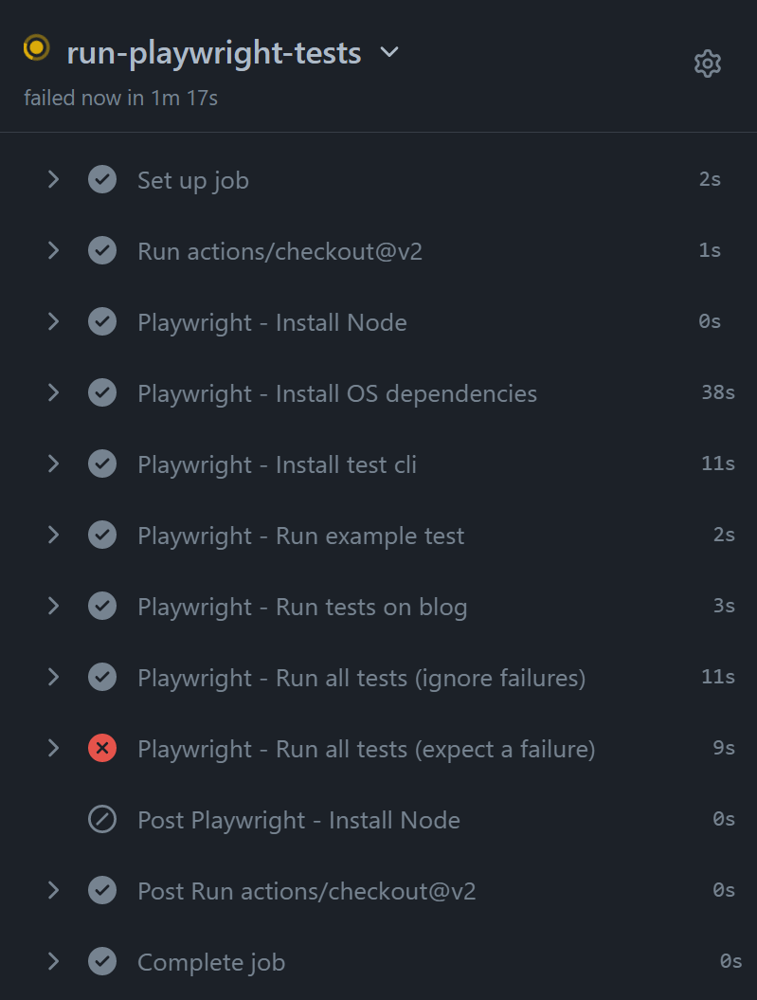

# PlaywrightFirstLook
Having a quick tour around using [Playwright](https://playwright.dev/)

## Things to go look at
- The [tests directory](https://github.com/Gordonby/PlaywrightFirstLook/tree/main/tests). Javascript files that were produced automagically on my laptop from the command line using `npx playwright codegen`. A handy browser pops up and records what you click on, type, etc.
- The [powershell script](https://github.com/Gordonby/PlaywrightFirstLook/blob/main/gettingstarted.ps1) i used for messing around with Playwright.
- The [github action workflow](https://github.com/Gordonby/PlaywrightFirstLook/blob/main/.github/workflows/playwrighttests.yml) that runs on a schedule/push/etc, which runs my test files.

## My action result

